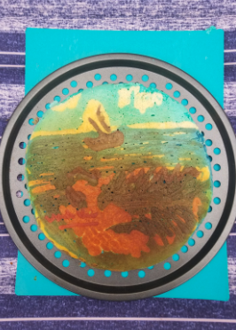

# brunch-roulette [WIP - not complete!]
Setting up tooling to facilitate a crowd-sourced covid time-killing activity

 

# What is Brunch Roulette?
A interactive remote-friendly group activity! Your group decides on a theme, 
everybody submits images in line with the theme. The fun part is: BOOM at kickoff,
everybody has exactly 1 hour to make an edible representation of their assigned 
image. No prep time, no advance shopping, just DIY your way through whatever you 
have on-hand -- and take a photo before your hour is up! The winner will be determined 
by a few survey-gathered metrics:

* How close did they get?? Can you tell which one was just created?
* Creativity -- how clever is it? 

 

# What exactly is the point
Not much of a point -- we wanted something to do, during early covid
quarantine, and this is what we came up with. We had a blast doing it, so sharing 
here in case someone else might enjoy as well.

These scripts help to automate a process that will collect submitted images, 
asssign them to each player, and send out kickoff emails so everyone has the 
same amount of prep time (none!) in order to create their culinary masterpiece.

 

# To set up you will need

* gmail / drive auth keys
* list of email addresses of participants
* google survey link set up in advance, to collect image submissions
* the theme of this roulette round

{width=30%} {width=30%}

# On game day you will need
A list of anyone who wants to participate but forgot to submit an image, which you'll 
update in the *_begin.r file. Also in that file, set up the kickoff timing, and run the script! 

{width=30%} {width=30%}

 

